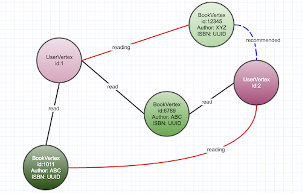

Book-Recommendations
======================================

This project is my learning curve with Titan Graph database with DynamoDB as a backend persistence store.

It is a `MULTI` model graph database. It consist of user vertices and book vertices. The edges on these vertices define the relationship between the user and the book.



### Relationships Edges
Currently following relationships are defined

`read` - book read by user

`reading` - user currently reading book

### Data Inferred
Currently the service can get list of books read, get list of common books read by 2 users.

### Future work
Get likes, favorites etc.

### Usage
To run this project locally, use the dev-in-box located in etc folder.

```bash
vagrant up
```

That sets up a vagrant box with the dynamodb and redis port locally.
